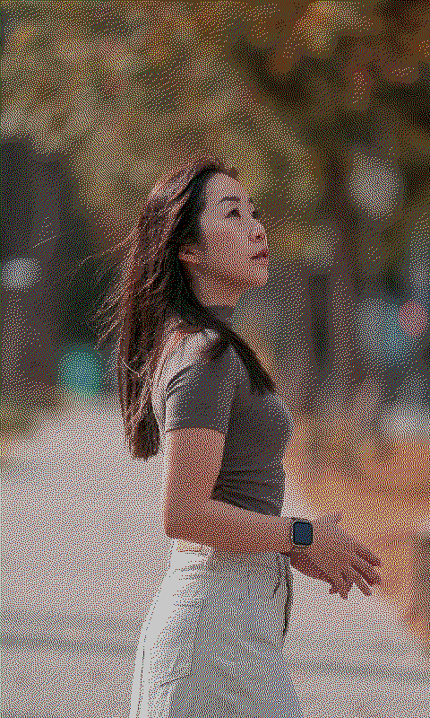

# ESP32-S3 PhotoFrame


A modern, feature-rich firmware for the **Waveshare ESP32-S3-PhotoPainter** that replaces the stock firmware with a powerful RESTful API, web interface, and **significantly better image quality**. This firmware provides superior image management, automatic rotation handling, drag-and-drop uploads, and intelligent power management.

**Product Page**: [Waveshare ESP32-S3-PhotoPainter](https://www.waveshare.com/wiki/ESP32-S3-PhotoPainter)

**🏠 Home Assistant Integration**: [ha-esp32-photoframe](https://github.com/aitjcize/ha-esp32-photoframe) - Companion integration for comprehensive control and monitoring through Home Assistant

## Key Features

- 🎨 **Superior Image Quality**: Measured color palette with automatic calibration produces significantly better results than stock firmware
- 🔋 **Smart Power Management**: Deep sleep mode for weeks of battery life, or always-on for Home Assistant
- 📁 **Flexible Image Sources**: SD card rotation or URL-based fetching (weather, news, random images)
- 🌐 **Modern Web Interface**: Drag-and-drop uploads, gallery view, real-time battery status
- 🔌 **RESTful API**: Full programmatic control ([API docs](docs/API.md))
- 🏠 **Home Assistant Ready**: [Companion integration](https://github.com/aitjcize/ha-esp32-photoframe) available

## Image Quality Comparison

**🎨 [Try the Interactive Demo](https://aitjcize.github.io/esp32-photoframe/)** - Drag the slider to compare algorithms in real-time with your own images!

<table>
<tr>
<td align="center"><b>Original Image</b></td>
<td align="center"><b>Stock Algorithm<br/>(on computer)</b></td>
<td align="center"><b>Stock Algorithm<br/>(on device)</b></td>
<td align="center"><b>Our Algorithm<br/>(on device)</b></td>
</tr>
<tr>
<td><a href="https://github.com/aitjcize/esp32-photoframe/raw/refs/heads/main/.img/sample.jpg"></a></td>
<td><a href="https://github.com/aitjcize/esp32-photoframe/raw/refs/heads/main/.img/stock_algorithm_on_computer.bmp"></a></td>
<td><a href="https://github.com/aitjcize/esp32-photoframe/raw/refs/heads/main/.img/stock_algorithm.bmp"></a></td>
<td><a href="https://github.com/aitjcize/esp32-photoframe/raw/refs/heads/main/.img/our_algorithm.png"></a></td>
</tr>
<tr>
<td align="center">Source JPEG</td>
<td align="center">Theoretical palette<br/>(looks OK on screen)</td>
<td align="center">Theoretical palette<br/>(washed out on device)</td>
<td align="center">Measured palette<br/>(accurate colors)</td>
</tr>
</table>

**Why Our Algorithm is Better:**

- ✅ **Accurate Color Matching**: Uses actual measured e-paper colors
- ✅ **Automatic Calibration**: Built-in palette calibration tool adapts to your specific display
- ✅ **Better Dithering**: Floyd-Steinberg algorithm with measured palette produces more natural color transitions
- ✅ **No Over-Saturation**: Avoids the washed-out appearance of theoretical palette matching

The measured palette accounts for the fact that e-paper displays show darker, more muted colors than pure RGB values. By dithering with these actual colors, the firmware makes better decisions about which palette color to use for each pixel, resulting in images that look significantly better on the physical display. The automatic calibration feature allows you to measure and optimize the palette for your specific device.

📖 **[Read the technical deep-dive on measured color palettes →](docs/MEASURED_PALETTE.md)**

## Power Management

**Deep Sleep Enabled (Default)**:
- Battery life: months
- Wake via BOOT/KEY button or auto-rotate timer
- Web interface accessible only when awake
- Power: ~10μA in sleep

**Deep Sleep Disabled (Always-On)**:
- Best for Home Assistant integration
- Web interface always accessible
- Power: ~40-80mA with auto light sleep
- Battery life: days to weeks depending on usage

**Auto-Rotation**: SD card (default) or URL-based (fetch from web)

Configure via web interface **Settings** section.

## Hardware Requirements

- **[Waveshare ESP32-S3-PhotoPainter](https://www.waveshare.com/wiki/ESP32-S3-PhotoPainter)**
- MicroSD card (FAT32)
- 2.4GHz WiFi network
- USB-C cable

## Installation

### Web Flasher (Easiest) ⚡

**[🌐 Flash from Browser](https://aitjcize.github.io/esp32-photoframe/)** - Chrome/Edge/Opera required

### Manual Flash

Download from [Releases](https://github.com/aitjcize/esp32-photoframe/releases):

```bash
esptool.py --chip esp32s3 --port /dev/ttyUSB0 --baud 921600 write_flash 0x0 photoframe-firmware-merged.bin
```

**Device not detected?** Hold BOOT button + press PWR to enter download mode.

**Build from source:** See [DEV.md](docs/DEV.md)

## Setup

> **⚠️ Insert MicroSD card before first boot**

### WiFi Provisioning

The device supports two methods for WiFi provisioning:

#### Option 1: SD Card Provisioning (Easiest)

1. Create a file named `wifi.txt` on your SD card with:
   ```
   YourWiFiSSID
   YourWiFiPassword
   ```
   - Line 1: WiFi SSID (network name)
   - Line 2: WiFi password
   - Use plain text, no quotes or extra formatting

2. Insert SD card and power on the device
3. Device automatically reads credentials, saves to memory, and connects
4. The `wifi.txt` file is automatically deleted after reading (to prevent issues with invalid credentials)

**Note**: If credentials are invalid, the device will clear them and fall back to captive portal mode.

#### Option 2: Captive Portal

1. Device creates `PhotoFrame-Setup` AP on first boot (if no credentials found)
2. Connect to the AP and open `http://192.168.4.1` (or use captive portal)
3. Enter WiFi credentials (2.4GHz only)
4. Device tests connection and saves if successful

**Re-provision:** Delete credentials with `idf.py erase-flash` or place new `wifi.txt` on SD card after clearing stored credentials

## Usage

**Web Interface:** `http://photoframe.local` or device IP address
- Gallery view with drag-and-drop uploads
- Settings, battery status, display control

**API:** Full documentation in [API.md](docs/API.md)

## Troubleshooting

- **WiFi issues**: Ensure 2.4GHz network, check serial monitor for IP
- **SD card not detected**: Format as FAT32, try different card
- **Upload fails**: Check file is valid JPEG, monitor serial output
- **Device not detected for flash**: Hold BOOT + press PWR for download mode

## Offline Image Processing

Node.js CLI tool for batch processing and image serving:

### Batch Processing
```bash
cd process-cli && npm install
# Process to disk
node cli.js input.jpg --device-parameters -o /path/to/sdcard/images/

# Or upload directly to device
node cli.js ~/Photos/Albums --upload --device-parameters --host photoframe.local
```

### Image Server Mode
Serve pre-processed images directly to your ESP32 over HTTP:

```bash
node cli.js --serve ~/Photos --serve-port 9000 --serve-format png --device-parameters --host photoframe.local
```

The ESP32 can fetch images from your computer instead of storing them on SD card. Supports BMP, PNG, and JPG formats with automatic thumbnail generation.

See [process-cli/README.md](process-cli/README.md) for details.

## License

This project is based on the ESP32-S3-PhotoPainter sample code. Please refer to the original project for licensing information.

## Credits

- Original PhotoPainter sample: Waveshare ESP32-S3-PhotoPainter
- E-paper drivers: Waveshare
- ESP-IDF: Espressif Systems
